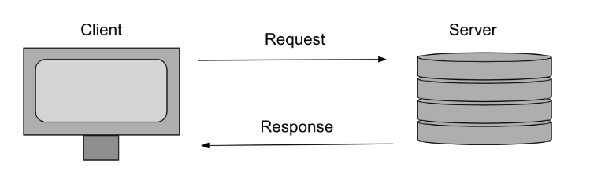

# Async JS and Fetch
Before Lecture
* Please pull down the main repo
    * `git pull mainRemote main`
* Also install json server
    * `npm install -g json-server`

* 6:00-6:15pm Fill out [Survey](https://forms.gle/LWYgZFoVWqz3XuJ46)
* 6:15 - 6:30pm Review
* 6:30 - 7:00pm How the internet work / JSON Server
* 7:00 - 7:10pm Break
* 7:10 - 8:00pm Async and Fetch
* 8:00 - 8:10pm break
* 8:10 - 9:00pm Canvas Self Study

## SWBAT
- Explain the request-response cycle
- Define each HTTP verb and their action
- Make a GET request using fetch
- Handle promises and return promises with .then 

## The Web


### CLIENT
* User interface
* Styling, layout, etc
* lightweight and loads fast
* Acts as a 'template' or 'layout' for dynamic data
* Makes requests to the server

### Server
* Responsible for storing and managing our data
* Changes in data may be triggered by the client, but the actual data change is handled by the server
* Sends response back to the server

What happens when you type a URL into the browser? 
Your browser makes a request to a server, that server sends some response, and your browser parses and process that data.

        Think about when you log into a website like Pinterest or Instagram. You are given an interface full of data curated and unique to you. Have you ever wondered why what when you log in is different from what your friends/family see when they log in? This is because clients can be treated like a template populated with data. 

When you log in, the client will return with the basic template of the web page and make requests for data specific to each user. 

In JavaScript, we can achieve this through HTTP requests.

## HTTP

* Language used to communicate between server and client
* Fetching resources
* Exchanging Data
* Readable
* Stateless
* [http vs https](https://www.cloudflare.com/learning/ssl/why-is-http-not-secure/#:~:text=HTTPS%20is%20HTTP%20with%20encryption,uses%20HTTPS%20has%20https%3A%2F%2F.)
       
        "The Hypertext Transfer Protocol (HTTP) is the foundation of the World Wide Web and is used to load web pages using hypertext links. HTTP is an application layer protocol designed to transfer information between networked devices and runs on top of other layers of the network protocol stack. A typical flow over HTTP involves a client machine making a request to a server, which then sends a response message."
[ Cloudflare, "What is HTTP?" 2022](https://www.cloudflare.com/learning/ddos/glossary/hypertext-transfer-protocol-http/)

In other words, HTTP is the language used by the client(browser). The server is used to communicate and exchange responses, including data.

## The Request 
A request has HTTP methods (also known as HTTP verbs)  defining the kind of request, the address of the request, and sometimes data or headers.

HTTP Methods

* GET: 
    * requests resources and retrieves data (READ)
* POST: 
    * sends data to the server (CREATE)
* PATCH: 
    * Updates part of a resource (UPDATE)
* PUT: 
    * Updates all of a resource (UPDATE)
* DELETE: 
    * Deletes a resource (DELETE)

## Using JSON Server

### JSON
* Similar to Javascript Objects
* Lightweight data storage for data exchange
* Works with any language
* Easy to read
[w3 json](https://www.w3schools.com/whatis/whatis_json.asp)
### JSON SERVER Installation
- Install JSON Server by running the following command in the terminal: `npm install -g json-server`
- To start the JSON server, run `json-server --watch db.json` while in the directory that contains the `db.json` file i.e. `SENG-SCF.../07-async-js-fetch`
- For this project, we will start with the following endpoint: `http://localhost:3000/pokemons`

## Fetch & Promise
.fetch() is a method that allows us to create an HTTP request. To Read, CREATE, UPDATE or DELETE resources.

It returns a **promise**.

When an asynchronous operation happens, a Promise is an object that represents its completion or failure. 
It has 3 states, pending, fulfilled, and rejected. 

.then() is a method called on a promise and returns a promise.

```js
// When given a URL fetch, create an HTTP GET request to the server the URL points to. It returns a promise.
//Once the promise has fulfilled the response from the server is passed to the .then() 
fetch(url)
.then()

// The .then takes a callback
// Within that callback we can parse the response by calling .json() on it. 
// .json() also returns a promise so we can chain a .then onto our original .then that will process the data once the promise from the .json() is fulfilled. 

fetch(url)
.then(response => {
    //retrives the data from our response
    return response.json()
})
.then(data => console.log(data))

```

## Resources
* [Recommended videos to explain async behavior](https://youtu.be/8aGhZQkoFbQ)
    * Note the above video is pretty old, we no longer use JQuery (Where he writes code that starts with $) But the content is still important to understanding how js works.
* [9 Parts of a URL You Should Know](https://medium.com/@joseph.pyram/9-parts-of-a-url-that-you-should-know-89fea8e11713)
* [ Cloudflare, "What is HTTP?" 2022](https://www.cloudflare.com/learning/ddos/glossary/hypertext-transfer-protocol-http/)
* [Learn about http requests](https://http.cat/)
* [JSON Server](https://www.npmjs.com/package/json-server)